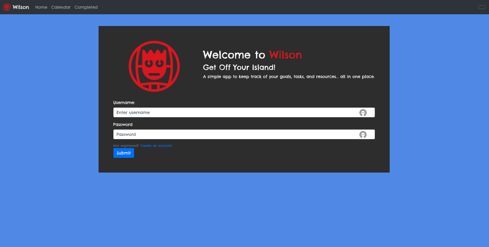
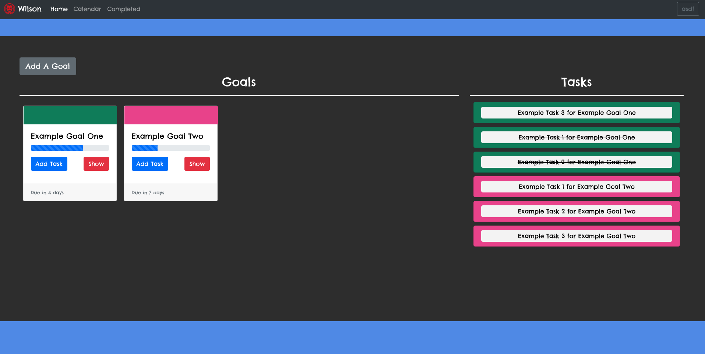
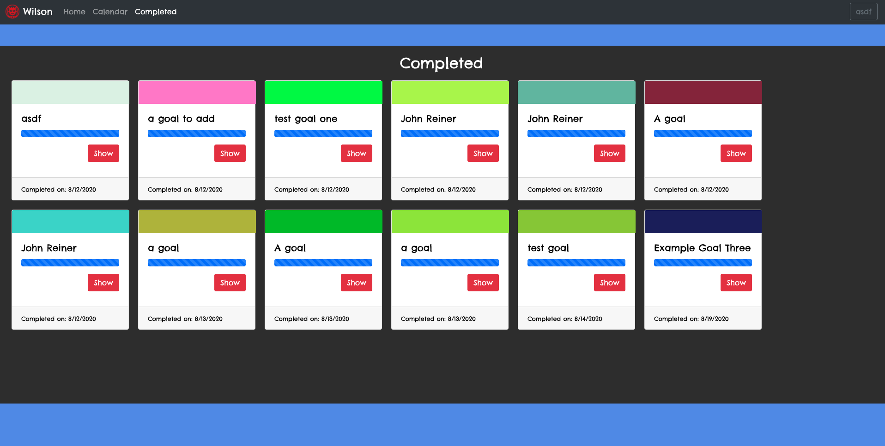
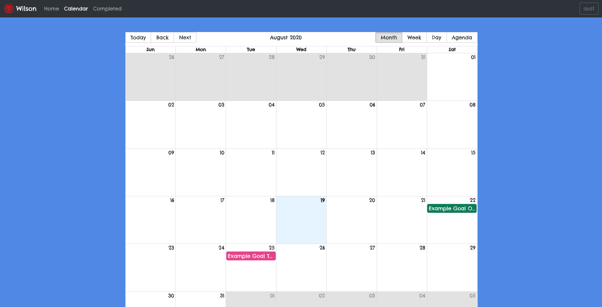

# Wilson

Wilson is an application designed to help users create and manage their goals. Each Goal has many tasks and when a user marks all the tasks assigned to that goal off, Wilson recognises that the goal is complete!

## Screen Shots

## Running / Setup Instructions

### Github Pages 

Head over to https://john-reiner.github.io/wilson/ you can create an account by clicking on the link above the submit button and start using Wilson!

### Local Server

Clone and pull the repo. Run NPM Install and then NPM Start to run Wilson on your local machine. Visit localhost:3000/wilson

## Background Information

This was my Mod-5 capstone project for The Flatiron School Software Development Program. I wanted to encapsulate all the tools and resources I learned over the program. Wilson is a Full Stack Web Application. It uses several technologies compiled together which include...
  
  - React.js
    - React Hooks
    - Several NPM Packages including React-Big-Calendar and React-Router
    - React Bootstrap
  - RESTful API
    - Built on Ruby on Rails
    
Originally I wanted to build an application that assigns users Resources for each Goal. As the project progressed I understood that tasks were more closely related to a Goal. In the future I will build out the Resources model to incorporate multiple Resources to each Goal created by the user. 
